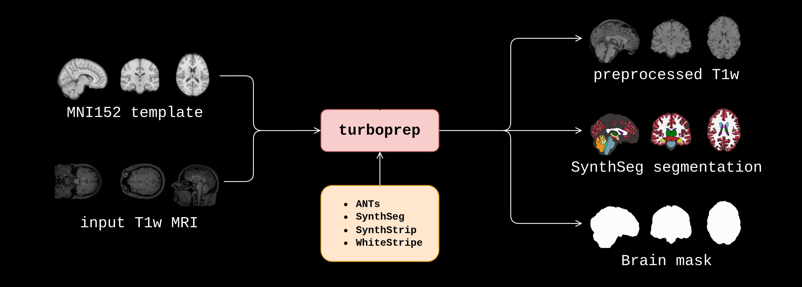

# ⚡ Turboprep


`turboprep` is a preprocessing script for structural MRIs built on top of awesome open-source tools (the full pipeline is described [here](#pipeline-description)). Given an input MRI and a reference space (e.g., the [MNI152 template](https://github.com/Washington-University/HCPpipelines/blob/master/global/templates/MNI152_T1_1mm_brain.nii.gz)), turboprep outputs an aligned, skull-stripped, and intensity-normalized MRI, along with its segmentation (using [SynthSeg](https://surfer.nmr.mgh.harvard.edu/fswiki/SynthSeg)) and brain mask. 


## 🆕 Run with Docker!

Installing FreeSurfer and ANTs too much hassle? Run `turboprep` with Docker! First, make sure you have [Docker installed](https://docs.docker.com/engine/install/), then run the `turboprep-docker` script:

```bash
./turboprep-docker /path/to/input/file.nii.gz \
                   /path/to/output/directory \
                   /path/to/template/file.nii.gz \
                   [OPTIONS]
```

On the first run, this will download and install the `lemuelpuglisi/turboprep` Docker image (~16GB of disk space required). 

The script runs `turboprep` using the `cpu` to simplify setup and avoid additional steps (e.g., installing the NVIDIA Docker runtime). Despite this, it still achieves a runtime comparable to the GPU version.


## Classic installation

`turboprep` script requires the following softwares to be installed:

* [FreeSurfer](https://surfer.nmr.mgh.harvard.edu/fswiki/DownloadAndInstall) >= v7.4
* [ANTs](https://github.com/ANTsX/ANTs)
* [intensity-normalization](https://github.com/jcreinhold/intensity-normalization)

A Docker container will be included in the future. 

## Usage (one input)

```bash
=====[ turboprep ]=====
Usage: /usr/bin/turboprep <image_path> <output_folder> <template_path> [OPTIONS]

Options:
  -t, --threads <threads>               Threads (default: number of cores)
  -s, --shrink-factor                   Bias field correction shrink factor (default: 3), see N4BiasFieldCorrection
  -m, --modality <modality>             Modality {t2,other,md,t1,pd,flair} (default is t1)
  -r, --registration-type <type>        Registration type {t,r,a} (default is 'a' (affine), see antsRegistrationSyNQuick.sh)
  --no-bfc                              Skip bias field correction step
  --keep                                Keep intermediate files

```

## Usage (multiple inputs)

```bash
usage: turboprep-multiple.py [-h] --inputs INPUTS --outputs OUTPUTS --template TEMPLATE [-m MODALITY] [-t THREADS] [-s SHRINK_FACTOR]
                         [-r REGISTRATION_TYPE] [--no-bfc NO_BFC] [--keep]

options:
  -h, --help            show this help message and exit
  --inputs INPUTS       text file where each line is the path of an image to process
  --outputs OUTPUTS     text file where each line is the path to an output
  --template TEMPLATE   path of template image
  -m MODALITY, --modality MODALITY
                        Modality {t2,other,md,t1,pd,flair} (default is t1)
  -t THREADS, --threads THREADS
                        Threads (default: number of cores)
  -s SHRINK_FACTOR, --shrink-factor SHRINK_FACTOR
                        Bias field correction shrink factor (default: 3), see N4BiasFieldCorrection
  -r REGISTRATION_TYPE, --registration-type REGISTRATION_TYPE
                        Registration type {t,r,a} (default is 'a' (affine), see antsRegistrationSyNQuick.sh)
  --no-bfc NO_BFC       text file listing the inputs for which to skip bias field correction
  --keep                Keep intermediate files
```

Example of `--inputs` file:

```
/path/to/images/input-a.nii.gz
/path/to/images/input-b.nii.gz
/path/to/images/input-c.nii.gz
```

Example of `--outputs` file:

```
/path/to/outputs/input-a/
/path/to/outputs/input-b/
/path/to/outputs/input-c/
```

Example of `--no-bfc` file (skip bias-field correction for `input-a` and `input-c`):

```
/path/to/images/input-a.nii.gz
/path/to/images/input-c.nii.gz
```

## Pipeline description

| Step n. | Description                        | Algorithm                                                    | Package                   |
| ------- | ---------------------------------- | ------------------------------------------------------------ | ------------------------- |
| 0       | Intensity inhomogeneity correction | N4 [1]                                                       | `ANTs`                    |
| 1       | Skull stripping                    | SynthStrip [7]                                               | `FreeSurfer`              |
| 2       | Affine registration to template    | Symmetric Diffeomorphic Image Registration (just affine registration) [2] | `ANTs`                    |
| 3       | Segmentation of brain tissues      | SynthSeg [3]                                                 | `FreeSurfer`              |
| 4       | Brain mask extraction              | Thresholding the segmentation                                | `FreeSurfer`              |
| 5       | Intensity normalization            | WhiteStripe [4]                                              | `intensity-normalization` |

## Registration alternatives

Two alternatives powered by deep learning are:

* EasyReg [6] - implemented in FreeSurfer as `mri_easyreg`
* SynthMorph [7] - implemented in FreeSurfer as `mri_synthmorph`

Both algorithms are great, but the overhead of loading the model make their running time slower compared to ANTs when performing affine image registration.

## Bibliography

```
[1] Tustison, Nicholas J., et al. "N4ITK: improved N3 bias correction." IEEE transactions on medical imaging 29.6 (2010): 1310-1320.

[2] Avants, Brian B., et al. "Symmetric diffeomorphic image registration with cross-correlation: evaluating automated labeling of elderly and neurodegenerative brain." Medical image analysis 12.1 (2008): 26-41.

[3] Billot, Benjamin, et al. "SynthSeg: Segmentation of brain MRI scans of any contrast and resolution without retraining." Medical image analysis 86 (2023): 102789.

[4] Shinohara, Russell T., et al. "Statistical normalization techniques for magnetic resonance imaging." NeuroImage: Clinical 6 (2014): 9-19.

[5] Iglesias, Juan Eugenio. "A ready-to-use machine learning tool for symmetric multi-modality registration of brain MRI." Scientific Reports 13.1 (2023): 6657.

[6] Hoffmann, M., et al. "SynthMorph: Learning image registration without images." IEEE Trans. Med. Imaging (2021).

[7] Hoopes, Andrew, et al. "SynthStrip: Skull-stripping for any brain image." NeuroImage 260 (2022): 119474.
```